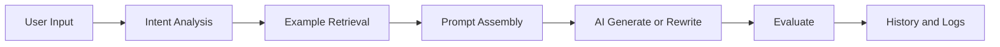

# Architecture

## Principle

- 프론트는 입력과 결과 표현에 집중한다.
- 백엔드는 intent, retrieval, assembly, evaluation을 담당한다.
- DB는 템플릿, 예시, 요청, 버전, 로그를 보관한다.
- AI는 내부 엔진의 한 단계로 사용한다.

## Flow

## Boundaries

- UI와 business logic을 분리한다.
- retrieval과 generation을 분리한다.
- admin과 public 흐름을 분리한다.
- user data와 operational logs를 분리한다.

